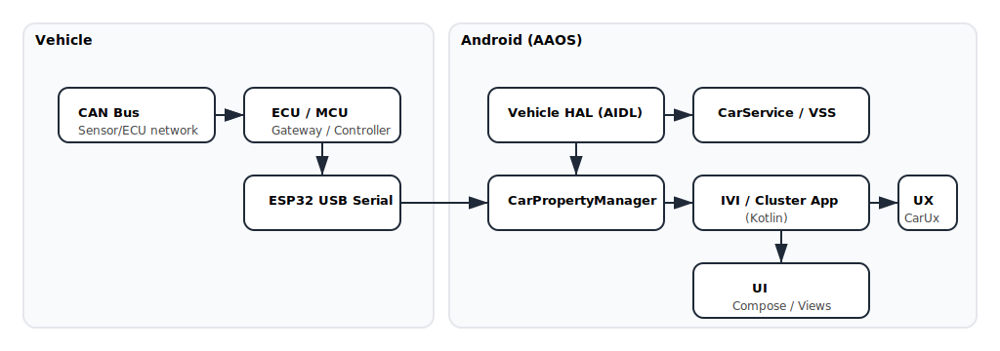

<!-- Hero -->

  

<h1 align="center">Hi, I'm Bajrang Solge</h1>

  
  
  
  

### ⚡ What I do
- Build **Android Automotive IVI & Instrument Cluster**: AOSP, HAL (AIDL), JNI, **CarService**, `CarPropertyManager`, power states, **CarUxRestrictions**, CAN over USB (ESP32).
- Cross-platform apps with **React Native & Flutter**; web with **React.js / MERN / Laravel**.
- **GenAI/RAG** systems on Confluence with **fine-grained access control (FGAC)**, Postgres/OpenSearch, Azure/AWS variants.
- CI/CD, cloud automation, and production-grade dashboards.

---

## 🛠 Tech Stack

  

---

## 🚀 Featured Projects
- **AAOS – IVI & Cluster (Solo build)**  
  HAL → **CarService** → `CarPropertyManager` → Kotlin UI; power states, UX safety, CAN/USB with ESP32.  
  Repos: [`aaos-ivi`](https://github.com/bajrangsolge/aaos-ivi) • [`cluster-app`](https://github.com/bajrangsolge/cluster-app)

- **ESP32 ↔ Android (JNI) – USB Serial + CAN**  
  Streaming telemetry + commands, diagnostics, safety hooks.  
  Repo: [`esp32-android-jni-can`](https://github.com/bajrangsolge/esp32-android-jni-can)

- **Recruiter/ATS (React + Redux + Laravel)**  
  Role & permission matrix, Interview stepper, AG Grid, exports, loaders & toasts.  
  Repo: [`recruiter-ats`](https://github.com/bajrangsolge/recruiter-ats)

- **Spendwise (MERN) – Expense Tracker**  
  Reminders, charts, categories, auth.  
  Repo: [`spendwise`](https://github.com/bajrangsolge/spendwise)

- **Confluence RAG w/ FGAC**  
  Extract → chunk → embed → **ACL-filtered retrieval**; Azure/AWS, Postgres/OpenSearch.  
  Repo: [`confluence-fgac-rag`](https://github.com/bajrangsolge/confluence-fgac-rag)

> After pushing these repos, **pin** up to 6 on your profile (Profile → “Customize your pins”).

---

## 🧭 Architecture Snapshot (AAOS)

  

---

## 📊 GitHub Stats

  
  

---

## 🤝 Connect
- 📩 **Email:** bajrangsolge07@gmail.com  
- 💼 **LinkedIn:** [bajrang-solge-811b2a212](https://linkedin.com/in/bajrang-solge-811b2a212)  
- 🌍 **From:** Pune, India
